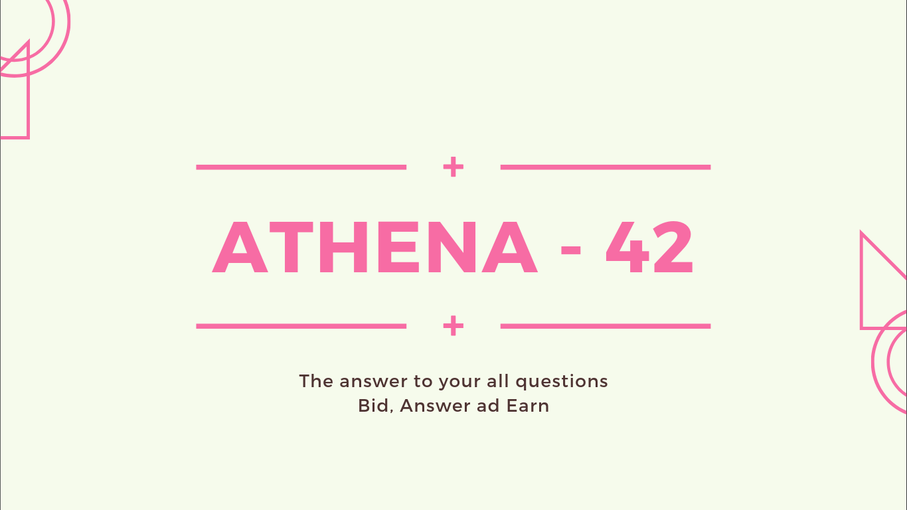
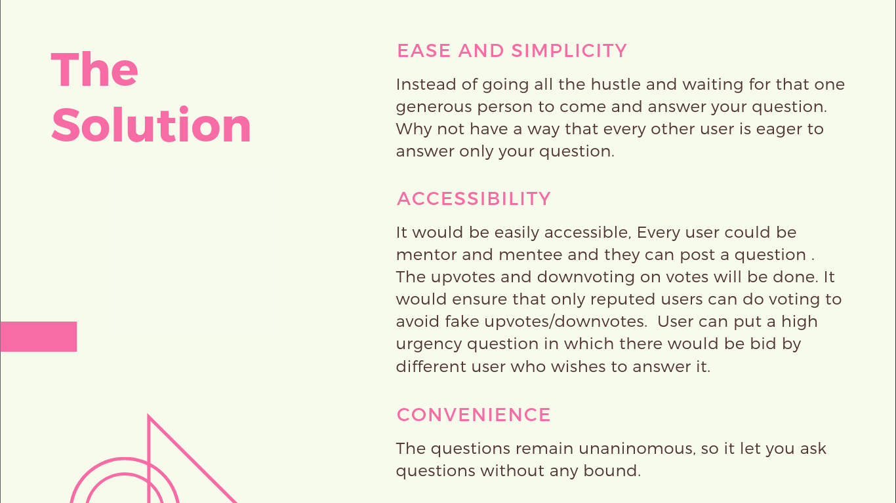
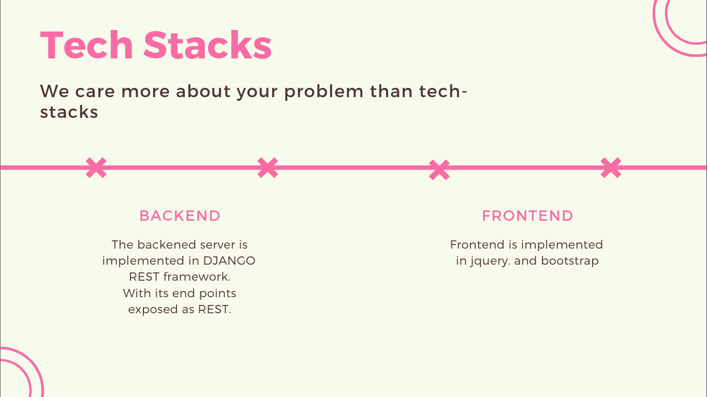

# Athena-42

The answer to your all questions

## Problem Statement
The weaker students in schools and colleges face problems that cannot be solved by online resources and tutorials and needs a personal mentor. The portal lets the students upload their problems anonymously. The mentors bid for the problem. Thereafter the portal maps the student to the mentor for personalized sessions online/onsite. The services may be chargeable.

## The Future Vision
* Avoiding Multiple Questions using NLP/ML
* The Editors for Posting and answering will have better features allowing markdown format, and syntax of various programming language.
* Person with extremely good reputation points will be given handsome perks.
* An Relation between Mentor and mentee. In this, task can be assigned, completed and learnt.